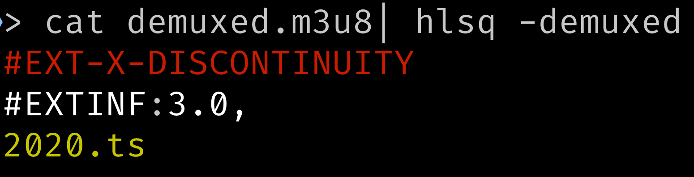

# HLSQ: [github.com/soldiermoth/hlsq](https://github.com/soldiermoth/hlsq)

A small CLI for adding some color to your HLS manifests and some basic filtering.
This CLI is not strict in its parsing so it will still work for manifests preceeded
by a grep. Named in tribute to the the great venerable [`jq`](https://github.com/stedolan/jq) cli.


## Filtering

There are some basic filtering operations available in this CLI in the form of a single `{attribute name} {op} {value}`, this will be expanded in the future to accept more complex queries.


Currently supported operations by value type
- Numbers: `>`, `>=`, `<`, `<=`, `=`, `!=`
- String: `=`, `!=`, `~`, `!~`, & `rlike`

## Install Instructions

### Pre-built Binary
Visit the [latest releases](https://github.com/soldiermoth/hlsq/releases) and pull a pre-built binary

### Homebrew

```
$ brew install soldiermoth/tap/hlsq
```

### From Source
Assuming a recent installation of Go is installed: [https://golang.org/doc/install](https://golang.org/doc/install)
```
$ go get github.com/soldiermoth/hlsq
```

## Demuxed Special Colors

As tribute to Demuxed2020 added colors matching the SWAG tshirts: `-demuxed`


